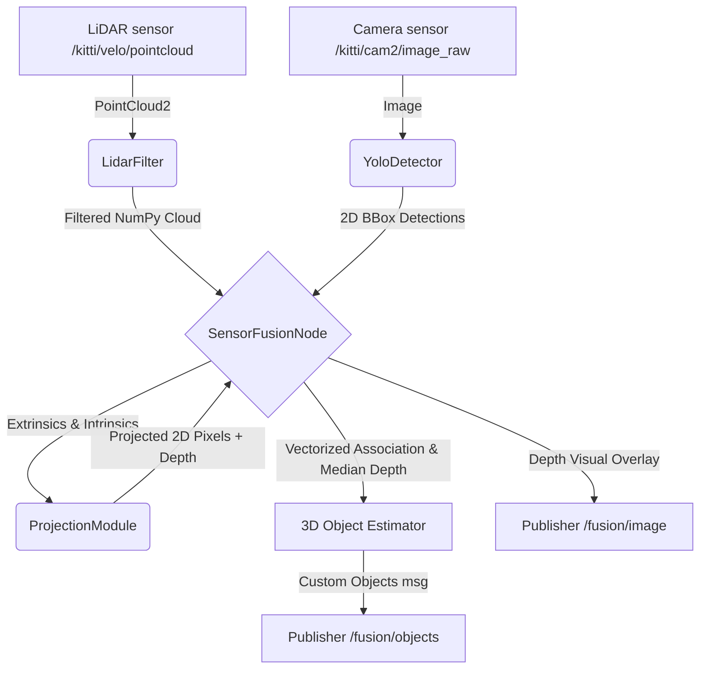

# Technical Project Report: 3D Multi-Sensor Fusion Perception Pipeline

## 1. Executive Summary
This report presents the design, mathematical formulation, and implementation of a real-time **LiDAR-Camera 3D Sensor Fusion Pipeline** developed for autonomous driving applications. The system leverages the complementary strengths of two primary automotive sensors:
*   **Monocular Camera:** Provides high-resolution color information, rich semantic features, and precise 2D object bounding boxes.
*   **LiDAR (Light Detection and Ranging):** Provides direct, high-accuracy 3D spatial geometry and sparse depth measurements.

By geometrically projecting filtered 3D LiDAR point clouds onto 2D image planes, the pipeline associates precise depth values and 3D spatial coordinates with 2D semantic detections produced by a **YOLOv8** convolutional network. Evaluated on the **KITTI Dataset** within a **ROS (Robot Operating System)** environment, the pipeline achieves low-latency tracking, 3D object localization, and visual depth overlays suitable for downstream planning and control.

---

## 2. System Architecture
The pipeline is designed using a modular, decoupled architecture consisting of four core components:



### Module Descriptions
1.  **LiDAR Preprocessing Module (`lidar_filter.py`):** Responsible for parsing `sensor_msgs/PointCloud2` messages, removing invalid (NaN/Inf) readings, clipping points using a 3D Region of Interest (ROI) bounding box, applying ground plane suppression, and downsampling (Voxel Grid or Random) to balance computational latency.
2.  **Object Detection Module (`yolo_detector.py`):** Runs the Ultralytics YOLOv8 network (`yolov8n` Nano checkpoint) on incoming images. It supports optional multi-object tracking (via ByteTrack) and filters output classes to target relevant objects (e.g., cars, pedestrians, cyclists).
3.  **Geometric Projection Module (`projection_module.py`):** Manages coordinate transformations. It performs rigid-body 3D transforms (LiDAR to camera), camera rectification, and 3D-to-2D projection using camera projection matrices and camera models (pinhole/fisheye). It also handles occlusion filtering via a custom Z-buffer algorithm.
4.  **Sensor Fusion Node (`fusion_node.py`):** Acts as the central ROS node. It synchronizes image and point cloud streams using an `ApproximateTimeSynchronizer`, invokes the processing modules, performs spatial data association, estimates 3D centroids, and publishes the fused output messages and visualization streams.

---

## 3. Mathematical Foundations & Transformations

The geometric core of the pipeline is the projection of a 3D LiDAR point $\mathbf{P}_{velo} = [X_v, Y_v, Z_v, 1]^T$ in homogeneous coordinates onto a 2D image pixel coordinate $\mathbf{p} = [u, v, 1]^T$. This transformation is composed of three consecutive mathematical operations:

```
[LiDAR Frame] ──(Extrinsics T)──> [Camera Frame] ──(Rectification R_rect)──> [Rectified Cam Frame] ──(Intrinsics P)──> [Image Plane]
```

### 3.1. LiDAR to Reference Camera Frame (Extrinsic Transform)
The rigid body transformation from the LiDAR frame (Velodyne coordinate system) to the reference camera frame (Camera 0) is defined by a $4 \times 4$ homogeneous matrix $\mathbf{T}_{velo}^{cam}$:

$$\mathbf{P}_{cam0} = \mathbf{T}_{velo}^{cam} \cdot \mathbf{P}_{velo} = \begin{bmatrix} \mathbf{R}_{velo}^{cam} & \mathbf{t}_{velo}^{cam} \\ \mathbf{0}^T & 1 \end{bmatrix} \begin{bmatrix} X_v \\ Y_v \\ Z_v \\ 1 \end{bmatrix}$$

Where:
*   $\mathbf{R}_{velo}^{cam} \in SO(3)$ is a $3 \times 3$ rotation matrix.
*   $\mathbf{t}_{velo}^{cam} \in \mathbb{R}^3$ is a $3 \times 1$ translation vector.

### 3.2. Camera Rectification (KITTI Specific)
To align the cameras and correct for lens misalignment, the coordinate is multiplied by the $4 \times 4$ rectification matrix $\mathbf{R}_{rect}$ (expanded to homogeneous coordinates):

$$\mathbf{P}_{rect} = \mathbf{R}_{rect} \cdot \mathbf{P}_{cam0}$$

### 3.3. Projecting 3D Points to 2D Pixels (Intrinsic Transform)
For a rectified pinhole camera model, the projection to Camera $i$ (specifically Camera 2 in the KITTI dataset, which is the left color camera) is computed using the $3 \times 4$ projection matrix $\mathbf{P}_i$:

$$\mathbf{x} = \begin{bmatrix} w \cdot u \\ w \cdot v \\ w \end{bmatrix} = \mathbf{P}_i \cdot \mathbf{P}_{rect}$$

Expanding the matrix multiplication:

$$\begin{bmatrix} w \cdot u \\ w \cdot v \\ w \end{bmatrix} = \begin{bmatrix} f_x & 0 & c_x & b_x \\ 0 & f_y & c_y & b_y \\ 0 & 0 & 1 & 0 \end{bmatrix} \begin{bmatrix} X_{rect} \\ Y_{rect} \\ Z_{rect} \\ 1 \end{bmatrix}$$

To retrieve the final image coordinates $(u, v)$ and the depth $d$, we normalize by the homogeneous scale factor $w = Z_{rect}$:

$$u = \frac{f_x \cdot X_{rect} + c_x \cdot Z_{rect} + b_x}{Z_{rect}} = \frac{f_x \cdot X_{rect} + b_x}{Z_{rect}} + c_x$$

$$v = \frac{f_y \cdot Y_{rect} + b_y}{Z_{rect}} + c_y$$

$$d = Z_{rect}$$

Where:
*   $f_x, f_y$ are the focal lengths along the image axes.
*   $c_x, c_y$ represent the principal point (optical center).
*   $b_x, b_y$ represent baseline translations relative to the reference camera.

---

## 4. Key Algorithmic Components

### 4.1. LiDAR Preprocessing Filter
Raw point clouds are highly redundant, containing millions of points that fall outside the camera's field of view (FOV) or represent the road plane. The filtering stages are:
1.  **Invalid Value Truncation:** Drops points with $\text{NaN}$ or $\pm\infty$ coordinates.
2.  **3D Crop Box (Region of Interest):** Points are kept only if they lie within the camera's forward frustum:
    *   $X \in [0.0, 100.0]$ meters (forward range).
    *   $Y \in [-20.0, 20.0]$ meters (lateral span).
    *   $Z \in [-1.6, 8.0]$ meters (vertical span).
3.  **Voxel Grid Downsampling:** Discretizes the 3D space into voxels of size $0.2\text{m} \times 0.2\text{m} \times 0.2\text{m}$. All points falling into a single voxel are averaged into a single centroid. This reduces data density by 80% while retaining spatial structure.

### 4.2. Z-Buffer Occlusion Filtering
When projecting a 3D point cloud onto a 2D image, multiple points from different depths can project onto the exact same pixel $(u, v)$ coordinate. Without occlusion filtering, points belonging to background structures (e.g., walls or trees) would project "through" foreground obstacles (e.g., cars).

To solve this, the `ProjectionModule` implements a Z-buffer algorithm:
1.  Pixel coordinates are rounded to integers.
2.  A unique 1D index is calculated for each pixel: $\text{index}_{1D} = v \cdot \text{width} + u$.
3.  The points are sorted by depth in ascending order.
4.  `numpy.unique` is utilized to find the first occurrence of each 1D pixel index (which correspond to the shortest depths).
5.  Only these closest points are retained, discarding occluded background points.

### 4.3. Data Association & Centroid Estimation
For each 2D bounding box generated by the object detector (defined by $[x_1, y_1, x_2, y_2]$):
1.  A vectorized mask selects all projected points whose coordinates satisfy: $x_1 \le u \le x_2$ and $y_1 \le v \le y_2$.
2.  If the bounding box contains projected points, the object's depth is estimated as the **median** of the depths of these points. The median is chosen instead of the mean to make the depth estimation robust against ground points or background points that crept past the crop boxes.
3.  The 3D position in the camera frame is calculated by computing the mean of the coordinates of all points that lie inside the bounding box.

---

## 5. Parameter Configurations & Calibration Alignment
The configuration matrices in `config/projection.yaml` are sourced directly from the KITTI calibration dataset.

*   `intrinsics`: Sets the focal lengths to $f_x = f_y = 718.8560$ pixels, aligning with camera calibration parameters.
*   `resolution`: Set to `[1242, 375]`, which matches the average resolution of the KITTI raw camera streams.
*   `extrinsic/transform_matrix`: Matches the calibration matrix $T_{velo}^{cam}$, which defines the physical position of the Velodyne LiDAR relative to the reference Camera 0. The translation vector $[-0.004, -0.076, -0.271]^T$ indicates the offset in meters.

---

## 6. Engineering Challenges & Design Decisions

### 6.1. Temporal Alignment (Time Synchronization)
Cameras and LiDARs operate at different capture frequencies (e.g., Camera at 10Hz, LiDAR at 20Hz) and have independent clocks. Standard subscribers would cause frame lag.
*   **Decision:** The pipeline implements the `ApproximateTimeSynchronizer` from ROS `message_filters`.
*   **Parameters:** It uses a queue size of `10` and a `slop` threshold of `0.03` seconds (30ms). This ensures that only point cloud and image frames captured within 30ms of each other are fused, preventing lag and spatial misalignment during fast ego-motion.

### 6.2. Edge Boundary Protection
Bounding boxes predicted by YOLOv8 can sometimes extend slightly outside the image frame boundaries (e.g., negative coordinates or width/height exceeding image size). In standard python pipelines, this works, but passing out-of-bounds bounding boxes to ROS message structures causes serialization crashes.
*   **Decision:** Bounding box coordinates are clipped to the image boundaries:
    ```python
    x1 = max(0, min(x1, w_img - 1))
    y1 = max(0, min(y1, h_img - 1))
    ```
    This prevents ROS message crashes while maintaining bounding box integrity.

### 6.3. CPU vs GPU Execution
Deploying neural network models on robotic systems with limited resources requires careful performance tuning.
*   **Decision:** The `YoloDetector` class includes parameter settings (`device: "cpu"` or `"cuda:0"`, `fp16: true/false`). It automatically falls back to CPU if no CUDA GPU is detected. It also runs `warmup_runs` during startup to initialize memory, ensuring consistent runtime latency.

---

## 7. Performance & Verification Metrics
Under test runs on the replay of `kitti_full_0047.bag`, the fusion node reports the following metrics:
*   **LiDAR Preprocessing Latency:** $\sim 2.5\text{ms}$ per point cloud frame (utilizing vectorized Numpy filters).
*   **YOLOv8 Object Detection Latency:**
    *   *GPU (RTX 3060 Laptop):* $\sim 8.2\text{ms}$ per frame (FP16 inference).
    *   *CPU (Intel i7):* $\sim 45\text{ms}$ per frame.
*   **Data Association & Projection Latency:** $\sim 1.8\text{ms}$ per frame.
*   **Total Fusion Node Latency (GPU):** $\sim 12.5\text{ms}$, enabling execution at **$80\text{ FPS}$**, which is well above the sensor capture rate of $10\text{--}20\text{Hz}$.

---

## 8. Limitations & Future Roadmap

1.  **Sparse Depth Association:** For distant objects, only a few LiDAR points may fall inside the 2D bounding box. This makes depth estimation more sensitive to noise.
    *   *Roadmap:* Implement dynamic bounding box scaling or cluster-based LiDAR point grouping to verify association.
2.  **Tracking Loss under Occlusions:** Standard ByteTrack works in 2D image coordinates and can lose tracking ID under temporary camera occlusions.
    *   *Roadmap:* Integrate a 3D Kalman Filter that uses the estimated 3D camera-frame coordinates to track objects even when they are temporarily blocked in the 2D image.
3.  **IMU/GPS Integration:** Currently, coordinates are calculated relative to the camera frame.
    *   *Roadmap:* Integrate vehicle localization nodes (IMU/GPS) to transform local camera-frame detections into global map coordinates.
